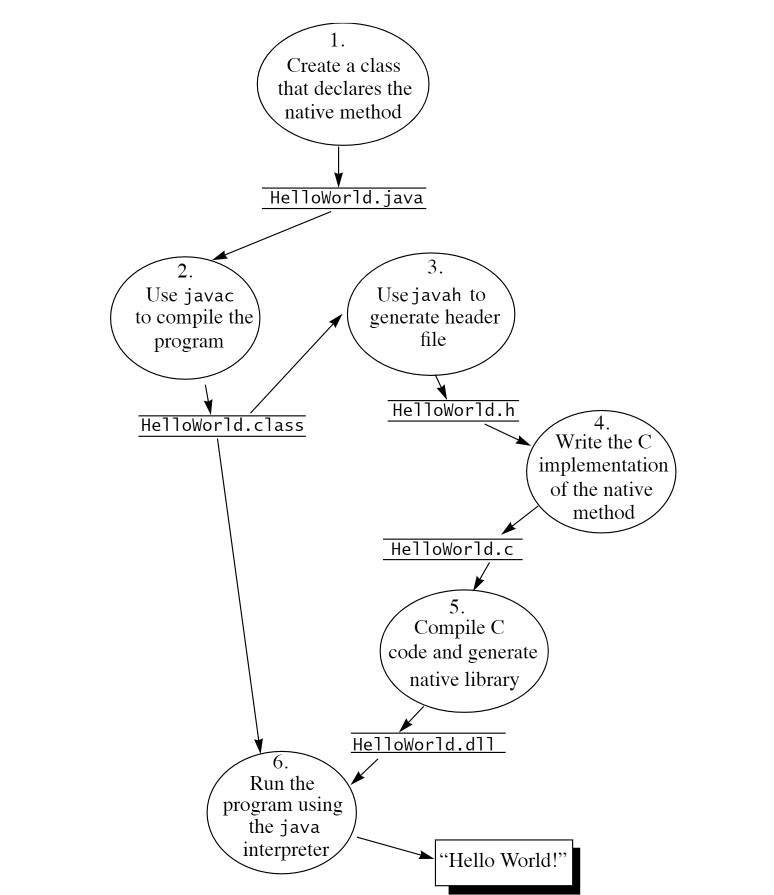

# jniStu
## 概述
本文档主要描述Java Native Interface的编程方法，这部分开发工作具备一定的难度，需要开发者分别对C/C++和Java均具备一些开发能力才可能逐步掌握。本文档会循序渐进的引入概念，以示例的方式进行学习和验证。

## 代码运行环境
- 操作系统
```
Linux 73e118e79fec 5.4.0-181-generic #201-Ubuntu SMP Thu Mar 28 15:39:01 UTC 2024 x86_64 x86_64 x86_64 GNU/Linux
```
- GCC
```
gcc version 9.4.0 (Ubuntu 9.4.0-1ubuntu1~20.04.1)
```
- Jdk
```
openjdk 11.0.25 2024-10-15
OpenJDK Runtime Environment (build 11.0.25+9-post-Ubuntu-1ubuntu120.04)
OpenJDK 64-Bit Server VM (build 11.0.25+9-post-Ubuntu-1ubuntu120.04, mixed mode, sharing)
```

## 遇到问题先跳转到Q&A环节
## chapter02 GettingStarted
**本章通过编写一个简单的JNI示例，让读者有个感性的认识。我们编写一个调用C函数的Java程序，打印输出“Hello World!”**

- 实现流程


***
1. 创建HelloWorld.java
``` java
class HelloWorld {
    static {
        System.loadLibrary("HelloWorld");
    }

    public static void main(String[] args) {
        new HelloWorld().print();
    }

    private native void print();
}
```
2. 使用javac编译HelloWorld.java文件，生成HelloWorld.class
``` sh
javac HelloWorld.java
```
3. 生成C语言的头文件HelloWorld.h
```sh
javac -h . HelloWorld.java
```
> HelloWorld.h内容如下：
``` C
/* DO NOT EDIT THIS FILE - it is machine generated */
#include <jni.h>
/* Header for class HelloWorld */

#ifndef _Included_HelloWorld
#define _Included_HelloWorld
#ifdef __cplusplus
extern "C" {
#endif
/*
* Class:     HelloWorld
* Method:    print
* Signature: ()V
*/
JNIEXPORT void JNICALL Java_HelloWorld_print
(JNIEnv *, jobject);

#ifdef __cplusplus
}
#endif
#endif
```
4. 参考HelloWorld.h头文件实现具体的具体方法,创建HelloWorld.c
``` C
#include <jni.h>
#include <stdio.h>
#include "HelloWorld.h"

JNIEXPORT void JNICALL Java_HelloWorld_print(JNIEnv *env, jobject obj) {
    printf("Hello World, this is your first demo about native coding.\n");
}
```
5. 将C语言实现的native方法编译成动态库`libHelloWorld.so`
``` sh
gcc -shared -I/usr/lib/jvm/java-11-openjdk-amd64/include -I/usr/lib/jvm/java-11-openjdk-amd64/include/linux -fPIC -o libHelloWorld.so HelloWorld.c
```
6. 运行java应用之前先导出环境变量`export LD_LIBRARY_PATH=.`
``` sh
java HelloWorld
```
> console输出如下：
``` sh
Hello World, this is your first demo about native coding.
```
- 为了描述清除整个流程，我们不得不逐步操作并实现相关代码[**<font color=Coral>这个繁琐的过程非常重要</font>**]。但是如果总是重复劳动，不仅累而且容易出错。所以咱可以写一个脚本(Makefile)，从繁杂琐碎的操作中解放出来，将精力放在具体业务上。脚本如下：
``` sh
all:
	javac -h . HelloWorld.java
	gcc -shared -I/usr/lib/jvm/java-11-openjdk-amd64/include -I/usr/lib/jvm/java-11-openjdk-amd64/include/linux -fPIC -o libHelloWorld.so HelloWorld.c	
	export LD_LIBRARY_PATH=.

.PHONY: clean run
clean:
	rm -rf *.so *.class HelloWorld.h
run:
	@java HelloWorld
```
- 给脚本添加运行权限，脚本看效果了。
```sh
chmod u+x Makefile
make
make run
```
- 每次试验可以运行**<font color=CornflowerBlue>make</font>**编译代码
``` sh
~/jniStu/src/chapter02$ make
javac -h . HelloWorld.java
gcc -shared -I/usr/lib/jvm/java-11-openjdk-amd64/include -I/usr/lib/jvm/java-11-openjdk-amd64/include/linux -fPIC -o libHelloWorld.so HelloWorld.c
export LD_LIBRARY_PATH=.
```
- 运行**<font color=CornflowerBlue>make run</font>**运行代码看效果
``` sh
~/jniStu/src/chapter02$ make run
Hello World, this is your first demo about native coding.
```
- 运行**<font color=CornflowerBlue>make clean</font>**清除工程
```
~/jniStu/src/chapter02$ make clean
rm -rf *.so *.class HelloWorld.h
```
## Q&A
- 什么时候使用JNI技术？
> 总体来说，当你的Java应用必须和native代码在一个进程中进行交互，就该使用jni技术了。

- 找不到so库?错误日志如下:
```
Exception in thread "main" java.lang.UnsatisfiedLinkError: no HelloWorld in java.library.path: [/usr/java/packages/lib, /usr/lib/x86_64-linux-gnu/jni, /lib/x86_64-linux-gnu, /usr/lib/x86_64-linux-gnu, /usr/lib/jni, /lib, /usr/lib]
        at java.base/java.lang.ClassLoader.loadLibrary(ClassLoader.java:2678)
        at java.base/java.lang.Runtime.loadLibrary0(Runtime.java:830)
        at java.base/java.lang.System.loadLibrary(System.java:1890)
        at HelloWorld.<clinit>(HelloWorld.java:3)
```
> 解决办法,导出环境变量，指定so库的加载路径
``` sh
export LD_LIBRARY_PATH=.
```
- 每次编译太麻烦了，有什么办法可以解放双手？
> 使用Makefile编写脚本，自动化构建。详情见工程源码中的Makefile

## 参考和资源
- [官方文档 Java Native Interface Specification Contents](https://docs.oracle.com/en/java/javase/21/docs/specs/jni/)
- The Java Native Interface — Programmer’s Guide and Specification(见本代码仓库doc文件夹)